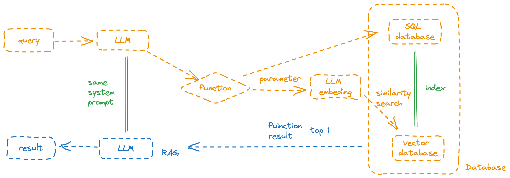

# JARVIS Smart To-do list assistant 

This is an intelligent to-do list assistant, integrated with the capabilities of LLM, allowing for more efficient and convenient management of projects, tasks, and ideas without the need for any spreadsheet work.

## The function includes:

1. Add a new project and show all the projects: 

2. Add a new task for project and show all the tasks in this project:

3. update project and update some tasks in project:

4. Add a new idea, show all the ideas and update the idea when getting similar idea:

Combining semantic search and vector databases, when a user adds a new project, task, or idea, if they input content with similar semantics, the system will return previously similar semantic content.

NOTE:

The shot term memory is based on streamlit message to storage.
The long term memory is stored by database.

## Start Guide

[Build from source](deploy.md)

## Legal

JARVIS is MIT-licensed, refer to the [LICENSE file](LICENSE)