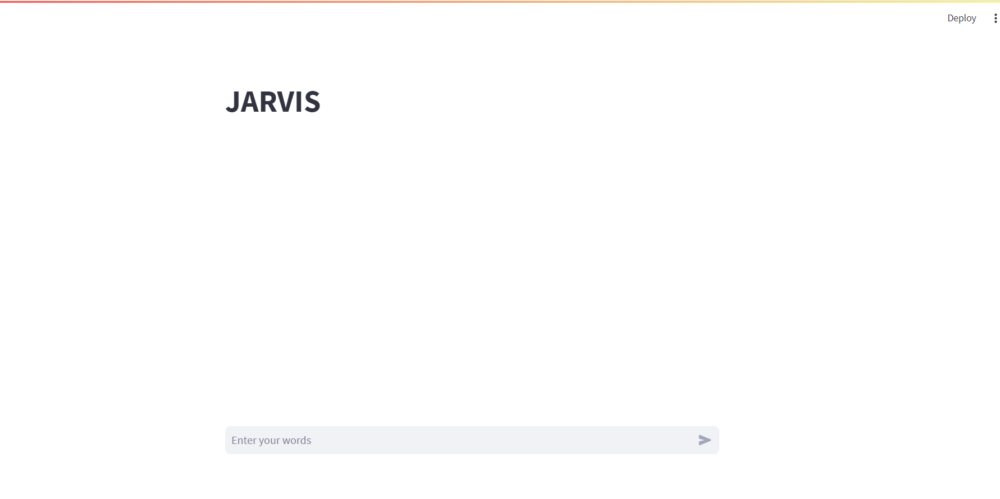

# Build from source


## Prerequisites

* To run the repo, MySQL is a must.

* A environment with **Python>=3.10** is a must.


###  Install MySQL

Please install MySQL based on your system, you can follow below tutorial.

* [EN tutorials](https://dev.mysql.com/doc/mysql-installation-excerpt/5.7/en/)

* [ZN tutorials](https://www.sjkjc.com/mysql/getting-started//)


### Install Dependencies

Clone repo and install [requirements.txt](./requirements.txt) in a
[**Python>=3.10.0**](https://www.python.org/) environment.


```bash
conda create -n jarvis python=3.10
conda activate jarvis

git clone git@github.com:waterIKA/JARVIS-A-Smart-To-do-list-assistant.git  # clone
cd JARVIS-A-Smart-To-do-list-assistant
pip install -r requirements.txt  # install
```


## Start a an idea and project manange assistant

* First of all, you must start MySQL with your password.

* replace some parametres in [config.yaml](config/config.yaml)

    * openai api key like "sk-xxxxxxx"

    ```Python
    config:
        openai:
        api_key: "repalce ypur openai api key"
    ```

    * MySQL password which is same with starting MySQL password.

    ```Python
    mysql_database:
        user_name: "root"
        password: "repalce your local mysql password"
    ```

* start assistant with streamlit and try it.

```bash
streamlit run app.py
```



